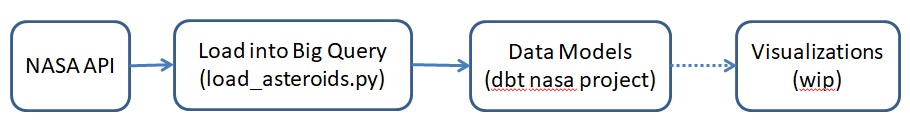

Study of nasa asteroids data

This project aims to provide a framework on how to derive data insights from nasa asteroids data.
Extraction is done on python, transformation on dbt, using a bigquery database.
It was created with the purpose of learning and making the best use possible of this technologies. So all feedback and suggestions are greatly appreciated.

Architecture

Support documentation

Generate nasa api key: https://api.nasa.gov/
Nasa api documentation: https://nasapy.readthedocs.io/en/latest/api.html?highlight=get_asteroids#near-earth-objects

Improvements to do:

Python: 
 - Making the code more robust to failure
 - Proper logging
 
dbt:
 - Improved models and segmentations
 - Proper testing and documentation
 
 
Visualization
 - To be added